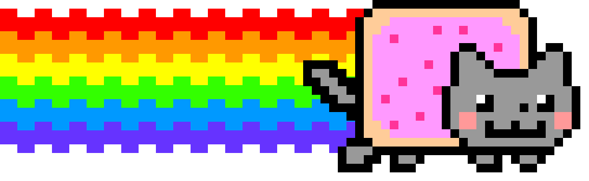

# nyan-cat

A terminal Nyan Cat. It walks in from the left, trails a rainbow, and disappears off the right edge —
drawn as a real image in your terminal, not as ASCII art.



## Requirements

- Go 1.26 or later
- A terminal that speaks one of these image protocols:

| Protocol | Terminals |
|---|---|
| kitty graphics (default) | kitty, WezTerm, Ghostty |
| iTerm2 inline images | iTerm2, WezTerm, VS Code |
| sixel | WezTerm, foot, xterm `-ti vt340` |

No image support? `-ascii` falls back to 256-color ANSI blocks.

## Install

Prebuilt binaries for Linux and macOS (amd64 / arm64) are attached to each
[release](https://github.com/jedipunkz/nyan-cat/releases). Or install with Go:

```bash
go install github.com/jedipunkz/nyan-cat@latest
```

Or build from a clone:

```bash
go build -o nyancat . && ./nyancat
```

## Usage

```bash
nyancat                    # kitty protocol, transparent background
nyancat -proto iterm       # iTerm2 inline images
nyancat -proto sixel       # sixel
nyancat -still             # draw one frame and exit (handy to test your terminal)
nyancat -ascii             # no images, ANSI blocks only
```

| Flag | Default | Description |
|---|---|---|
| `-proto` | `kitty` | Image protocol: `kitty`, `iterm`, `sixel` |
| `-bg` | off | Paint the space-colored background instead of leaving it transparent |
| `-scale` | `1` | Pixel scale factor |
| `-still` | off | Draw a single frame and exit |
| `-ascii` | off | Draw with ANSI blocks instead of images |
| `-png` | — | Write one frame to a PNG file and exit |

If nothing shows up, try each protocol with `-still` and use whichever one draws the cat.
Note that sixel does not survive tmux older than 3.4.

## How it works

- The cat is the original 272x168, 12-frame GIF from [nyan.cat](https://www.nyan.cat/), embedded with
  `go:embed` and decoded at runtime with `image/gif`.
- That GIF has no rainbow, so the rainbow is drawn procedurally and aligned to the Pop-Tart body.
- Each frame is composed into a palette-indexed canvas, then handed to the terminal as a PNG
  (kitty / iTerm2) or as a sixel stream written by hand.
- Standard library only — no dependencies.

## Credits

Nyan Cat artwork by Christopher Torres (prguitarman), 2011. Music, and the meme's name, come from
daniwell's "Nyanyanyanyanyanyanya!" by way of saraj00n. The GIF is bundled here so the command runs
offline; all rights to the artwork remain with its creator.
